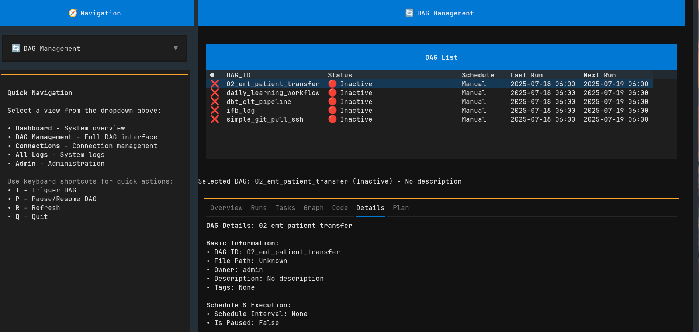

# Airflow TUI

**Airflow TUI** is a terminal-based user interface (TUI) for Apache Airflow, built with [Textual](https://github.com/Textualize/textual).



## Installation

> This project uses [`uv`](https://github.com/astral-sh/uv) as the Python package manager.

```bash
git clone https://github.com/your-org/airflow-tui.git
cd airflow-tui
uv venv
source .venv/bin/activate
uv pip install -r requirements.txt
```

## Quick Start

```bash
python -m src.tui.app
```

## Requirements

- Python 3.10+
- Access to the Airflow REST API

## TODO

- [ ] Log viewing interface
- [ ] Keyboard navigation support
